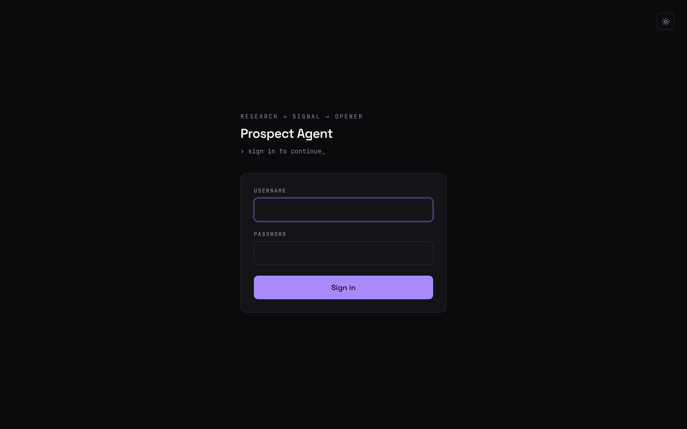

# Prospect Agent

Researches a company with Claude's web search, finds one specific recent
signal (funding, a hire, a product launch, ...), and drafts a 2–3 sentence
cold outreach opener built on that single fact. Also has a "signals" mode
that scores a list of companies (recency / trigger strength / specificity)
without drafting an opener, for prioritizing who to reach out to first.


<p>
  
  
</p>

<sub>Screenshots use fictional example companies and sources.</sub>

Features:

- **Draft** — single company or a batch (one per line), each row with its
  own loading/retry state and a live elapsed-seconds counter while the
  research runs.
- **Signals** — rank a list of companies by signal strength, no opener.
- **Research trace** — each fresh draft or signal shows the web searches
  the agent actually ran and how each came back: the result count, or the
  error code in red. A query run twice in a row shows once with "×2". In
  the signals table the trace is folded into a "N web searches · M failed"
  line you can expand. The trace isn't stored; saved prospects show their
  source link instead.
- **Source links** — shown as the hostname (`techcrunch.com`), and only
  when the URL is `http(s)`.
- **CSV export** — download batch/signal results as `prospects-<date>.csv`.
- **Saved prospects** — every draft is stored in Postgres; the list loads
  25 at a time ("load more", cursor-paginated) and each prospect can be
  edited (status `new` / `contacted` / `replied`, company, website,
  signal, source, opener) or deleted.
- **Sign-in** — a sign-in page gates the whole app (UI + API) once
  credentials are set, with a "sign out" button in the header. See
  [Sign-in](#sign-in).
- **Light / dark theme** — dark by default; the toggle in the header
  remembers your choice in `localStorage`.

## How the research works

Each company is one call to the Claude API (`lib/research.ts`):

- **Model:** `claude-sonnet-5-5` with `effort: "medium"` and
  `max_tokens: 16000`. Sonnet 5.5 thinks by default and thinking counts
  toward `max_tokens`, so the cap leaves room for thinking plus the JSON
  reply.
- **Web search:** the basic web search tool (`web_search_20250305`), at
  most 5 searches per company. In practice a company takes 2–3 searches
  and under 20 seconds.
- **Today's date** goes at the top of every request, so "recent" is judged
  against the real date, not the model's idea of what year it is.
- **Refusal fallback:** if Sonnet 5.5 declines a company, the API retries it
  on Anthropic's recommended substitute model inside the same call (see
  [Notes](#notes)).

Why the basic search tool: the newer `web_search_20260209` filters results
through its own code execution before the model sees them. In side-by-side
runs (October 2026) it ran the same query twice in a row, and on one
company it hid recent news that its own searches had returned (the model
said "only one search returned usable results" for searches with 9–10 hits
each). The basic tool hands the model the results directly: it found the
recent news every run, never repeated a query, and was about 2.5× faster
(under 20s instead of about 50s). To compare again, change `type` in
`WEB_SEARCH_TOOL` in `lib/research.ts`; the research trace then marks those
searches "via code".

How the agent picks the signal (both modes):

- Each search looks for a different kind of news (funding, leadership
  changes, launches or partnerships), and no query is run twice.
- **Recency comes first.** Among facts from the last 6 months it picks the
  strongest buying trigger; an older fact is used only when nothing recent
  turned up. A strong trigger from 8 months ago loses to a decent one from
  last month.
- **One target role**, as a single title: no slashes, no "or", no
  alternatives in parentheses.

How the opener is written (draft mode; the full rules are the `SYSTEM`
prompt in `lib/research.ts`):

- Opens with the fact, stated plainly. No "I saw", no flattery, no pitch,
  no meeting ask. Ends on one specific question about what might be
  breaking.
- **Absolute dates** ("on September 21"), never relative ones ("last
  week"): drafts are saved and may be sent days later. A fact older than
  6 months gets its month and year ("in November 2025").
- No sentence explaining what the signal implies; the reader knows their
  own business.
- **Never tells the reader what their own job has become** (no "so you're
  just COO now"). For a role change it says who took or left which job,
  then asks the question.
- Never invents a fact: if nothing specific turns up, the signal says so
  and the opener stays plain.

## API routes

| Route | Method | What it does |
|---|---|---|
| `/api/draft` | POST | Research a company and draft an opener, then save it. The response also carries `searches`: each web query run, with its result count or error code |
| `/api/signal` | POST | Research and score a company's signal, no opener; includes `searches` (same shape) |
| `/api/prospects` | GET | List saved prospects (`?cursor=` for the next page) |
| `/api/prospects/[id]` | PATCH | Update any subset of a prospect's fields |
| `/api/prospects/[id]` | DELETE | Delete a prospect |
| `/api/login` | POST | Sign in (form post from `/login`); sets the session cookie |
| `/api/logout` | POST | Sign out; clears the session cookie |

## Stack

- Next.js 16 (App Router) + TypeScript, Tailwind CSS (colors are
  CSS-variable tokens in `app/globals.css`, one set per theme)
- Space Grotesk + JetBrains Mono via `next/font`
- Prisma + PostgreSQL (Supabase)
- Anthropic SDK (`claude-sonnet-5-5` on the beta Messages endpoint, web
  search tool `web_search_20250305`)
- Zod for validating the model's JSON output

## Setup

1. **Install dependencies**
   ```bash
   npm install
   ```

2. **Environment variables** — copy the example file and fill it in:
   ```bash
   cp .env.example .env.local
   ```
   - `ANTHROPIC_API_KEY` — from the Anthropic Console. Web search must be
     enabled for your org.
   - `DATABASE_URL` / `DIRECT_URL` — Supabase Postgres connection strings.
     `DATABASE_URL` is the pooled connection (port 6543, `?pgbouncer=true`),
     used at runtime. `DIRECT_URL` is the direct connection (port 5432),
     used by `prisma migrate`. Get both from Supabase's Project Settings →
     Connect → ORM tab.
   - `APP_BASIC_AUTH_USER` / `APP_BASIC_AUTH_PASSWORD` — the username and
     password for the app's sign-in page, which gates the whole app (UI +
     API routes) so a shared/scraped URL can't burn your Anthropic budget.
     Leave both empty for local dev; the app is then open.
     **Before any real deploy, set both** and generate the password
     locally rather than hardcoding one:
     ```bash
     node -e "console.log(require('crypto').randomBytes(24).toString('base64url'))"
     ```

3. **Run migrations**
   ```bash
   npm run prisma:migrate
   ```

4. **Start the dev server**
   ```bash
   npm run dev
   ```

## Scripts

| Command | What it does |
|---|---|
| `npm run dev` | Start the Next.js dev server |
| `npm run build` | Generate the Prisma client, then production build |
| `npm run start` | Serve the production build |
| `npm run lint` | ESLint |
| `npm run typecheck` | `tsc --noEmit` |
| `npm run test` | Run the unit test suite once (Vitest) |
| `npm run test:watch` | Run the test suite in watch mode |
| `npm run draft -- "Company" "website.com"` | Run the research+draft engine standalone from the terminal, no UI/DB. Prints the JSON result to stdout. |
| `npm run prisma:generate` | Regenerate the Prisma client after a schema change |
| `npm run prisma:migrate` | Run Prisma migrations against `.env.local` |
| `npm run prisma:push` | Push the schema without creating a migration (quick local iteration) |

## Tests

Unit tests cover the parts of the app that are pure logic and prone to
silent bugs:

- `lib/research.test.ts` — the model's JSON extraction + Zod validation,
  the dated user message, reading each web search's query, result count,
  error code and "via code" flag, and the refusal fallback. Mocked against
  the Anthropic SDK, so no API key or network call is needed.
- `lib/searchTrace.test.ts` — collapsing back-to-back repeated searches.
- `lib/prospects.test.ts` — cursor pagination.
- `lib/parseLines.test.ts` — batch/signal line parsing and dedup.
- `lib/url.test.ts` — the `signalSource` link-safety check and hostname
  label.
- `lib/session.test.ts` — sign-in session tokens.

They run in CI on every push and PR, after lint and typecheck.

Out of scope for now: the API route handlers themselves (`app/api/**`)
aren't covered by automated tests — they were verified manually against a
real Postgres instance during development. Adding real route/integration
tests would need a test database wired into CI.

## Sign-in



- Turned on by setting both `APP_BASIC_AUTH_USER` and
  `APP_BASIC_AUTH_PASSWORD`. With either one unset, the app is open and
  `/login` redirects home.
- Enforced by `proxy.ts` (Next.js 16's replacement for `middleware.ts`).
  Signed-out page requests redirect to `/login`; API requests get a 401.
- `/login` is a plain HTML form that posts to `/api/login`, so it works
  without JavaScript. Both fields are checked in constant time, and a
  wrong attempt waits 400ms before redirecting back with an error.
- A successful sign-in sets an HttpOnly, SameSite=Lax session cookie: a
  stateless HMAC-signed token valid for 30 days (`lib/session.ts`). The
  signing key comes from the credentials, so changing either var signs
  everyone out.
- To open the app again, remove both vars and redeploy.

## Deploying (Vercel)

- Mirror every var from `.env.local` into the Vercel project's environment
  variables — `DATABASE_URL`, `DIRECT_URL`, `ANTHROPIC_API_KEY`,
  `APP_BASIC_AUTH_USER`, `APP_BASIC_AUTH_PASSWORD`. Vercel stores vars per
  environment, so tick both Production and Preview if you use preview
  deploys. A changed var only takes effect after a redeploy.
- Merging to `master` deploys to production automatically.
- The build script runs `prisma generate` before `next build`. Vercel
  caches `node_modules`, and Prisma refuses to start on Vercel when its
  client was only generated by the install step, so every database read
  would fail with a server error.
- `package.json` has an `allowScripts` list approving the install scripts
  of `@prisma/client`, `@prisma/engines`, `prisma`, `esbuild` and
  `unrs-resolver`. npm 11 only warns about unapproved scripts; npm 12
  skips them. Check `npm install-scripts ls` (npm 12) after adding a
  dependency that has an install script.
- Each research call logs one line to the server logs (Vercel → Logs):
  `[research] draft "Acme" model=… stop=… web_search_requests=… searches:
  "q" 8 results | "q2" error:too_many_requests`. A failed web search is a
  normal 200 with an error code in place of results, so this (and the
  trace in the UI) is where failures show up.
- A research call can run up to 5 web searches per company; the API
  routes set `maxDuration = 60` to give it room.

### Troubleshooting

- **"This page couldn't load" / a 500 on every page.** The home page
  reads the database on every load, so this usually means the database is
  unreachable. Supabase pauses free-tier projects after about a week
  without activity: open the project in the Supabase dashboard and click
  **Restore project**, then reload. (The other cause, a Prisma client not
  generated during the build, is handled by the build script above.)
- **A draft says nothing recent turned up.** Check its research trace or
  the `[research]` log line: a red error code means the search itself
  failed (e.g. `too_many_requests`), not that there was no news.

## Notes

- Research calls go through the beta Messages endpoint with server-side
  refusal fallback (`fallbacks: "default"`): if Sonnet 5.5's safety
  classifiers decline a company, the API retries on Anthropic's
  recommended substitute model in the same call. Only some refusal
  categories are retried, so a decline can still surface as an error.
  Server-side fallback is Claude API only (not Bedrock/Vertex/Foundry).
- The `Prospect` table is intentionally a single flat table (see the
  comment in `prisma/schema.prisma`) — resist normalizing it for v1.
- `signalSource` is whatever URL the model returns from its research; it's
  only rendered as a clickable link when it parses as `http(s)` (see
  `isHttpUrl` in `lib/url.ts`, used by `app/draft-form.tsx`).
- `AGENTS.md` and `CLAUDE.md` are written by `next dev` (Next.js 16's
  rules file for AI coding agents) and committed so the working tree stays
  clean.

## Changelog

### October 2026

- **Model:** research moved to `claude-sonnet-5-5` with explicit effort
  and room for thinking, and a refusal now shows its own error
  ([#3](https://github.com/RedOctober7/prospect-agent/pull/3)). Added
  the server-side refusal fallback
  ([#4](https://github.com/RedOctober7/prospect-agent/pull/4)).
- **UI:** light/dark theme with WCAG AA contrast, new fonts, the research
  trace, hostname source links, the elapsed counter, a better mobile
  layout, and README screenshots
  ([#5](https://github.com/RedOctober7/prospect-agent/pull/5)). Long target
  roles wrap in the signals table
  ([#9](https://github.com/RedOctober7/prospect-agent/pull/9)), and so do
  long source hostnames.
- **Deploy fixes:** `prisma generate` runs in the build, which fixed the
  500 on Vercel ([#6](https://github.com/RedOctober7/prospect-agent/pull/6)).
  Install scripts are approved via `allowScripts` for npm 12
  ([#7](https://github.com/RedOctober7/prospect-agent/pull/7)).
- **Sign-in:** a styled sign-in page with a session cookie and sign out,
  replacing the browser's Basic Auth prompt
  ([#8](https://github.com/RedOctober7/prospect-agent/pull/8)).
- **Research quality**, tuned on real runs:
  - The model gets today's date, so it stopped drafting on year-old news
    as if it were fresh ([#9](https://github.com/RedOctober7/prospect-agent/pull/9)).
  - Varied searches, the strongest trigger, one role, absolute dates
    ([#10](https://github.com/RedOctober7/prospect-agent/pull/10)).
  - Each search's outcome in the trace and the server logs
    ([#11](https://github.com/RedOctober7/prospect-agent/pull/11)).
  - Up to 5 searches, with repeats shown once
    ([#12](https://github.com/RedOctober7/prospect-agent/pull/12)).
  - Recency before trigger strength
    ([#13](https://github.com/RedOctober7/prospect-agent/pull/13)).
  - The switch to the basic web search tool, which made runs about 2.5×
    faster ([#14](https://github.com/RedOctober7/prospect-agent/pull/14),
    [#15](https://github.com/RedOctober7/prospect-agent/pull/15)).
  - Openers no longer tell the reader what their own job has become
    ([#15](https://github.com/RedOctober7/prospect-agent/pull/15)).
- **Docs:** README brought up to date
  ([#2](https://github.com/RedOctober7/prospect-agent/pull/2)), and again
  in this update: how the research works, sign-in, troubleshooting, new
  screenshots.
