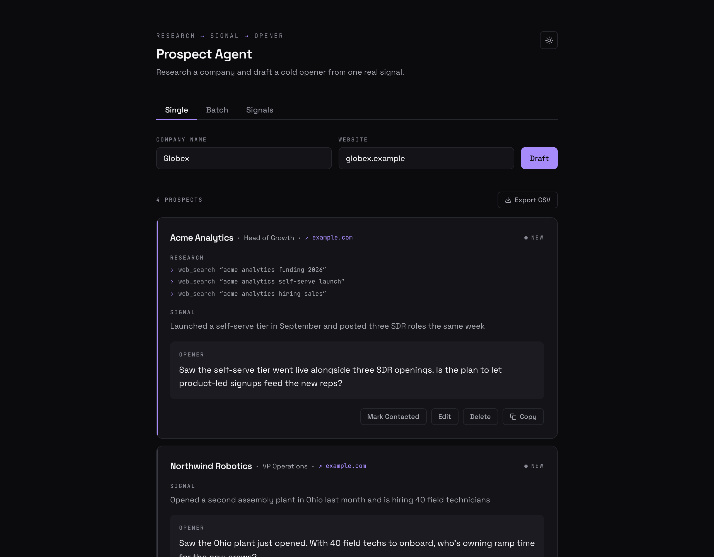
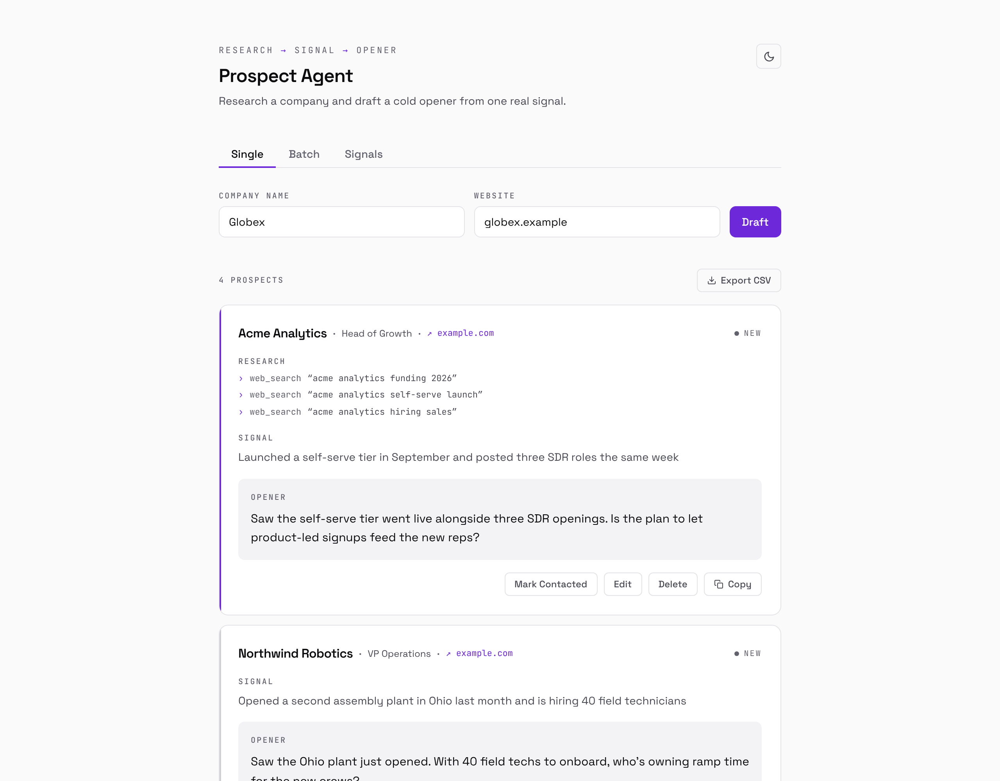
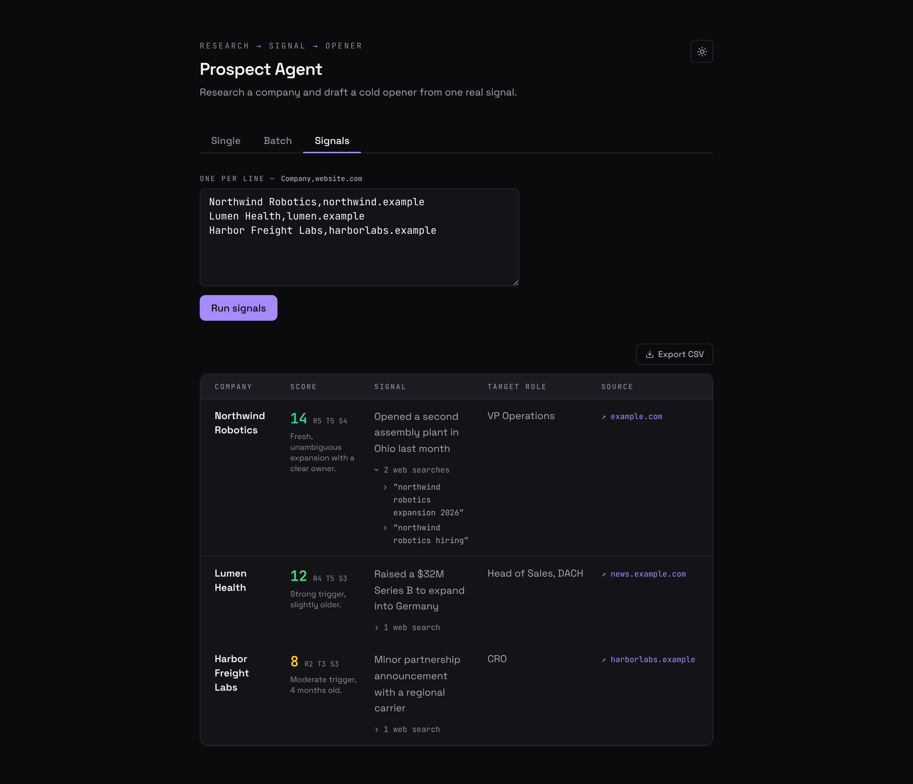

# Prospect Agent

Researches a company with Claude's web search, finds one specific recent
signal (funding, a hire, a product launch, ...), and drafts a 2–3 sentence
cold outreach opener built on that single fact. Also has a "signals" mode
that scores a list of companies (recency / trigger strength / specificity)
without drafting an opener, for prioritizing who to reach out to first.



<p>
  
  
</p>

<sub>Screenshots use fictional example companies and sources.</sub>

Features:

- **Draft** — single company or a batch (one per line), each row with its
  own loading/retry state.
- **Signals** — rank a list of companies by signal strength, no opener.
- **Research trace** — each fresh draft or signal shows the web searches
  the agent actually ran, so a rep can see what the signal is based on.
  The trace isn't stored; saved prospects show their source link instead.
- **CSV export** — download batch/signal results as `prospects-<date>.csv`.
- **Saved prospects** — every draft is stored in Postgres; the list loads
  25 at a time ("load more", cursor-paginated) and each prospect can be
  edited (status `new` / `contacted` / `replied`, company, website,
  signal, source, opener) or deleted.
- **Light / dark theme** — dark by default; the toggle in the header
  remembers your choice in `localStorage`.

## API routes

| Route | Method | What it does |
|---|---|---|
| `/api/draft` | POST | Research a company and draft an opener, then save it. The response also carries `searches` (the web queries run) |
| `/api/signal` | POST | Research and score a company's signal, no opener; includes `searches` |
| `/api/prospects` | GET | List saved prospects (`?cursor=` for the next page) |
| `/api/prospects/[id]` | PATCH | Update any subset of a prospect's fields |
| `/api/prospects/[id]` | DELETE | Delete a prospect |

## Stack

- Next.js (App Router) + TypeScript, Tailwind CSS (colors are CSS-variable
  tokens in `app/globals.css`, one set per theme)
- Space Grotesk + JetBrains Mono via `next/font`
- Prisma + PostgreSQL (Supabase)
- Anthropic SDK (`claude-sonnet-5-5`, web search tool)
- Zod for validating the model's JSON output

## Setup

1. **Install dependencies**
   ```bash
   npm install
   ```

2. **Environment variables** — copy the example file and fill it in:
   ```bash
   cp .env.example .env.local
   ```
   - `ANTHROPIC_API_KEY` — from the Anthropic Console. Web search must be
     enabled for your org.
   - `DATABASE_URL` / `DIRECT_URL` — Supabase Postgres connection strings.
     `DATABASE_URL` is the pooled connection (port 6543, `?pgbouncer=true`),
     used at runtime. `DIRECT_URL` is the direct connection (port 5432),
     used by `prisma migrate`. Get both from Supabase's Project Settings →
     Connect → ORM tab.
   - `APP_BASIC_AUTH_USER` / `APP_BASIC_AUTH_PASSWORD` — gates the whole
     app (UI + API routes) behind HTTP Basic Auth so a shared/scraped URL
     can't burn your Anthropic budget. Leave both empty for local dev.
     **Before any real deploy, set both** and generate the password
     locally rather than hardcoding one:
     ```bash
     node -e "console.log(require('crypto').randomBytes(24).toString('base64url'))"
     ```

3. **Run migrations**
   ```bash
   npm run prisma:migrate
   ```

4. **Start the dev server**
   ```bash
   npm run dev
   ```

## Scripts

| Command | What it does |
|---|---|
| `npm run dev` | Start the Next.js dev server |
| `npm run build` | Production build |
| `npm run start` | Serve the production build |
| `npm run lint` | ESLint |
| `npm run typecheck` | `tsc --noEmit` |
| `npm run test` | Run the unit test suite once (Vitest) |
| `npm run test:watch` | Run the test suite in watch mode |
| `npm run draft -- "Company" "website.com"` | Run the research+draft engine standalone from the terminal, no UI/DB. Prints the JSON result to stdout. |
| `npm run prisma:generate` | Regenerate the Prisma client after a schema change |
| `npm run prisma:migrate` | Run Prisma migrations against `.env.local` |
| `npm run prisma:push` | Push the schema without creating a migration (quick local iteration) |

## Tests

Unit tests cover the parts of the app that are pure logic and prone to
silent bugs: cursor pagination (`lib/prospects.test.ts`), the model's
JSON-extraction + Zod validation pipeline, mocked against the Anthropic
SDK so no API key or network call is needed (`lib/research.test.ts`),
batch/signal line parsing and dedup (`lib/parseLines.test.ts`), and the
`signalSource` link-safety check (`lib/url.test.ts`). They run in CI on
every push and PR.

Out of scope for now: the API route handlers themselves (`app/api/**`)
aren't covered by automated tests — they were verified manually against a
real Postgres instance during development. Adding real route/integration
tests would need a test database wired into CI.

## Deploying (Vercel)

- Mirror every var from `.env.local` into the Vercel project's environment
  variables — `DATABASE_URL`, `DIRECT_URL`, `ANTHROPIC_API_KEY`,
  `APP_BASIC_AUTH_USER`, `APP_BASIC_AUTH_PASSWORD`.
- Basic Auth is enforced by `proxy.ts` (Next.js 16's replacement for
  `middleware.ts`) and runs automatically once both `APP_BASIC_AUTH_*`
  vars are set — no extra Vercel config needed.
- A research call can run up to 3 web searches per company; the API
  routes set `maxDuration = 60` to give it room.

## Notes

- Research calls go through the beta Messages endpoint with server-side
  refusal fallback (`fallbacks: "default"`): if Sonnet 5.5's safety
  classifiers decline a company, the API retries on Anthropic's
  recommended substitute model in the same call. Only some refusal
  categories are retried, so a decline can still surface as an error.
  Server-side fallback is Claude API only (not Bedrock/Vertex/Foundry).

- The `Prospect` table is intentionally a single flat table (see the
  comment in `prisma/schema.prisma`) — resist normalizing it for v1.
- `signalSource` is whatever URL the model returns from its research; it's
  only rendered as a clickable link when it parses as `http(s)` (see
  `isHttpUrl` in `lib/url.ts`, used by `app/draft-form.tsx`).
